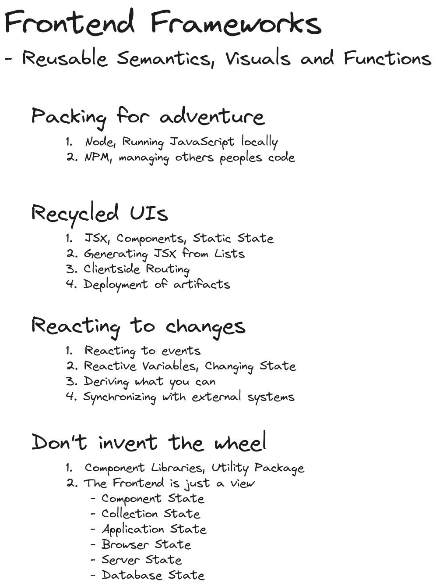

# Frontend Frameworks

## Content

- [About](#about)
- [Submodules](#submodules)
  1. [Recycled UIs](#recycled-uis)
  2. [Routing](#routing)
  3. [Reacting to Change](#reacting-to-change)

## About

## Submodules

### Recycled UIs
#### [Project](./1-recycled-uis/)

This shows the basic of React and ViteJS project

### Routing
#### [Project](./2-routing/)

Basic example of how to setup a React SPA (Single Page Application) with a couple of pages. Check the [official tutorial](https://reactrouter.com/en/main/start/tutorial) for a more complex example with data loading.

### Reacting to Change
#### [Project](./3-reactive-variables/)

Shows how to add some simple state to your components by way of the React useState hook. Contains a simple counter and a search filter.